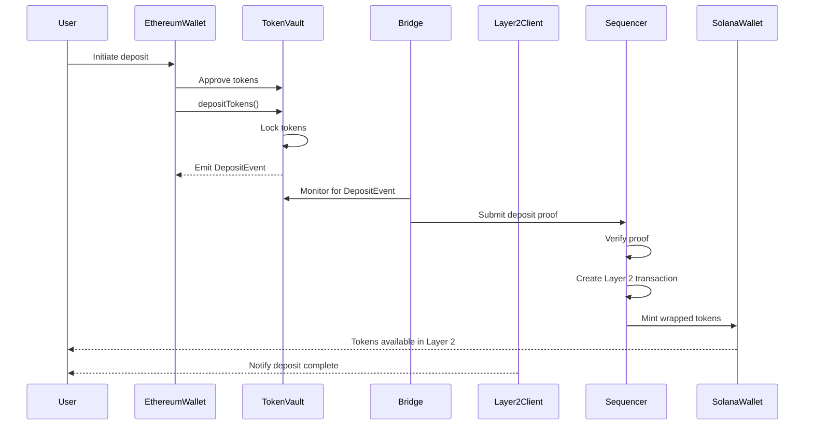

# Layer 2 Deposit Flow

```mermaid
sequenceDiagram
    participant User
    participant EthereumWallet
    participant TokenVault
    participant Bridge
    participant Layer2Client
    participant Sequencer
    participant SolanaWallet

    User->>EthereumWallet: Initiate deposit
    EthereumWallet->>TokenVault: Approve tokens
    EthereumWallet->>TokenVault: depositTokens()
    TokenVault->>TokenVault: Lock tokens
    TokenVault-->>EthereumWallet: Emit DepositEvent
    Bridge->>TokenVault: Monitor for DepositEvent
    Bridge->>Sequencer: Submit deposit proof
    Sequencer->>Sequencer: Verify proof
    Sequencer->>Sequencer: Create Layer 2 transaction
    Sequencer->>SolanaWallet: Mint wrapped tokens
    SolanaWallet-->>User: Tokens available in Layer 2
    Layer2Client-->>User: Notify deposit complete
```