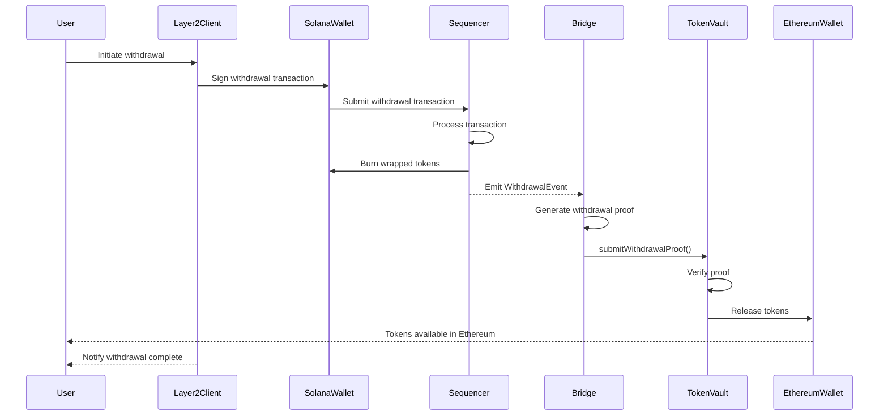

# Layer 2 Withdrawal Flow

```mermaid
sequenceDiagram
    participant User
    participant Layer2Client
    participant SolanaWallet
    participant Sequencer
    participant Bridge
    participant TokenVault
    participant EthereumWallet

    User->>Layer2Client: Initiate withdrawal
    Layer2Client->>SolanaWallet: Sign withdrawal transaction
    SolanaWallet->>Sequencer: Submit withdrawal transaction
    Sequencer->>Sequencer: Process transaction
    Sequencer->>SolanaWallet: Burn wrapped tokens
    Sequencer-->>Bridge: Emit WithdrawalEvent
    Bridge->>Bridge: Generate withdrawal proof
    Bridge->>TokenVault: submitWithdrawalProof()
    TokenVault->>TokenVault: Verify proof
    TokenVault->>EthereumWallet: Release tokens
    EthereumWallet-->>User: Tokens available in Ethereum
    Layer2Client-->>User: Notify withdrawal complete
```