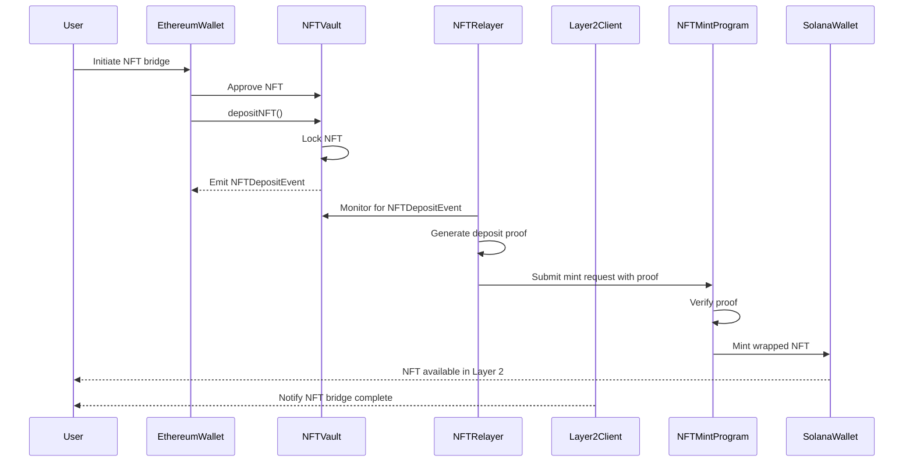

# NFT Bridge Flow

```mermaid
sequenceDiagram
    participant User
    participant EthereumWallet
    participant NFTVault
    participant NFTRelayer
    participant Layer2Client
    participant NFTMintProgram
    participant SolanaWallet

    User->>EthereumWallet: Initiate NFT bridge
    EthereumWallet->>NFTVault: Approve NFT
    EthereumWallet->>NFTVault: depositNFT()
    NFTVault->>NFTVault: Lock NFT
    NFTVault-->>EthereumWallet: Emit NFTDepositEvent
    NFTRelayer->>NFTVault: Monitor for NFTDepositEvent
    NFTRelayer->>NFTRelayer: Generate deposit proof
    NFTRelayer->>NFTMintProgram: Submit mint request with proof
    NFTMintProgram->>NFTMintProgram: Verify proof
    NFTMintProgram->>SolanaWallet: Mint wrapped NFT
    SolanaWallet-->>User: NFT available in Layer 2
    Layer2Client-->>User: Notify NFT bridge complete
```